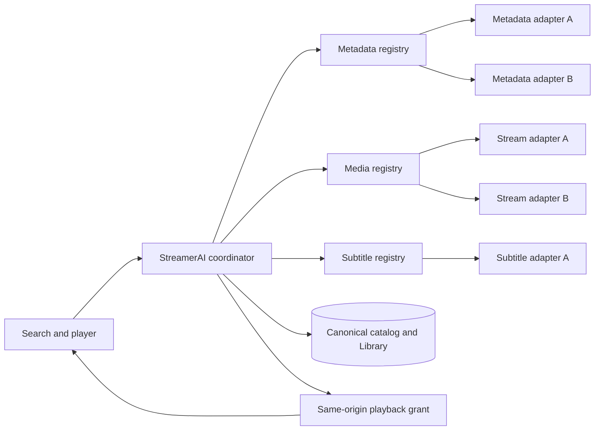

# Integration development

Integrations are replaceable adapters. A provider name must not leak into
Library, History, UI routing or canonical identity. The normative product and
compliance rules are in [`../instructions/INTEGRATIONS.md`](../instructions/INTEGRATIONS.md).

## Connector contract v1

`@streamer-ai/contracts` is the boundary between StreamerAI and every source.
An adapter translates one external system into these records; the coordinator
never parses an external API response. `CONNECTOR_CONTRACT_VERSION` is the major
version of this boundary. `descriptor().connectorVersion` is the adapter's own
release version and changes independently. A new adapter must declare
`contractVersion: CONNECTOR_CONTRACT_VERSION`; the field may be absent only in
older built-in adapters, which the validator treats as v1. A future incompatible
contract must use a new major version and a deliberate migration, not silently
reinterpret v1 data.

The source contract consists of three families:

| Family | Required methods | Normalized output |
| --- | --- | --- |
| `MetadataProvider` | `descriptor`, `health`, `search`, `getTitle`, `getSeriesStructure`, `getRatings`, `getFeed` | `MetadataCandidate`, `CanonicalTitlePayload`, `SeriesStructure`, `SourceRating` |
| `MediaProvider` | `descriptor`, `health`, `search`, `inspect`, `createPlayback`; optional `checkPlayback` and `refreshPlaybackSource` | `MediaCandidate`, `MediaVariant`, `PlaybackGrant` |
| `SubtitleProvider` | `descriptor`, `health`, `search`, `fetch` | `SubtitleCandidate`, `SubtitleAsset` |

The interfaces and their strict Zod schemas are in
[`packages/contracts/src/providers.ts`](../packages/contracts/src/providers.ts).
Source IDs and shared context/provenance are in
[`provider-common.ts`](../packages/contracts/src/provider-common.ts).
`assertConnectorDescriptor`, `assertConnectorAttribution`, and the redacted
`ProviderFailure` shape are in
[`connector-contract.ts`](../packages/contracts/src/connector-contract.ts).
Use the exported types and schemas directly. Do not copy them into a connector.

### Identity and data flow



`CatalogTitle.id` is a StreamerAI identity. `ExternalEntityRef` identifies a
metadata entity at one source; `MediaCandidateRef` and `SubtitleCandidateRef`
identify selectable results at their own sources. Never interpret an opaque
external ID outside its adapter or use one as a Library primary key. A
title's optional `metadataRef` preserves the full metadata reference when a
long external ID cannot fit inside the bounded `CatalogTitle.id`. It must name
the same metadata provider and movie/series kind as the title. A
`TitleSource` carries a provider ID and candidate ID, release/episode identity,
verified format, and check time. It must never carry a direct stream URL.
Multiple `TitleSource` records on one title are alternatives, not duplicate
catalog entries. Metadata fields and ratings retain their own provenance.

### Descriptor and capability negotiation

Every adapter exposes a public, non-secret `descriptor()`. The stable ID is a
lowercase slug matching `^[a-z][a-z0-9-]{0,79}$` and must remain unchanged
across adapter upgrades. Its family
must match the registry. `SOURCE_CONNECTOR_CAPABILITIES` lists the v1 names
understood by core code. Declare only features actually implemented. A
connector-specific feature may use `x-<provider-id>:<feature>`; core code ignores
it until an explicit integration adds support. Typos in standard capability
names and another connector's extension namespace fail registration. Unknown
capabilities never imply a fallback implementation.

```ts
import {
  CONNECTOR_CONTRACT_VERSION,
  assertConnectorDescriptor,
  type MediaProvider,
} from "@streamer-ai/contracts";

const provider: MediaProvider = new MyMediaAdapter(dependencies);
const descriptor = assertConnectorDescriptor(provider.descriptor(), "media");
// descriptor.contractVersion === 1; register only after this succeeds.
```

The descriptor also supplies `displayName`, supported UI locales, setup mode,
credential field descriptors, health/recheck/disconnect flags, documentation
link, and a plain-language privacy summary. These are public metadata only.
The setup form stores values through the server's `SecretStore` and passes an
opaque `secretRef` in `ProviderContext`; the browser never receives the secret
or a secret reference. A built-in entry in `INTEGRATION_DESCRIPTORS` supplies
localized onboarding copy. Community IDs must also be accepted by the runtime
integration catalog and persistent connection table; adding a TypeScript
adapter alone does not make it selectable in Settings. The app can list
registered adapter descriptors dynamically, while built-in descriptors provide
the initial curated catalog. Do not hard-code a closed provider-ID enum in
source routing or the persisted connection schema.

`ProviderContext` carries a request ID, profile scope, locale, deadline,
optional `AbortSignal`, and opaque secret reference. Respect both deadline and
cancellation in every network/file operation, including retries. `health()`
must be read-only, bounded, and describe actual connectivity; a successful
local configuration check alone does not prove that a remote service is healthy.
The TypeScript interfaces are deliberately stable across partial providers:
when an optional capability is absent, its method must report
`UNSUPPORTED_CAPABILITY` instead of fabricating a result. Coordinators must
check declared capabilities before calling it.

### Mapping each family

**Metadata.** `search` returns bounded, source-owned candidates. Resolve the
selected `ExternalEntityRef` with `getTitle`; provide series and episode
structure when supported. Return exact source ratings with their own `source`,
`value`, and `scale`; never merge unlike scales into one score. `null` means a
value is unavailable, not that the connector may invent one. Normalize dates,
locale, title aliases, image URLs, and year. Put `FieldProvenance` on external
claims, using the adapter's ID and release version. A metadata enricher such as
ČSFD can contribute a field or rating without replacing the canonical record.

**Media.** `search` finds plausible files for a canonical title and, for a
series, the requested season and episode. `inspect` verifies a candidate and
returns its real format, Range capability, embedded subtitle tracks, and
expiry. A filename match is only a candidate; it is not proof of playback.
`checkPlayback` may verify current availability without issuing a grant.
`createPlayback` must recheck the selected candidate and return a short-lived
same-origin grant. The server owns any direct URL, filesystem handle, network
mount, or credential. A grant is profile-scoped and never persisted in Library
or sent to another adapter. A source outage yields unknown availability, while
a successful empty search can mean unavailable. Alternative files retain their
own source IDs so the user may choose or retry another one. If a direct URL can
expire while a grant is active, implement `refreshPlaybackSource` using the
validated `PlaybackSourceRefreshRequest` (`candidate` plus `variantId`). It
returns a new URL to the server only; seek/retry routes must validate the URL
again and never send it to the browser. The ticket must retain the candidate
ID separately from the variant ID because a provider may use different values.

**Subtitles.** `search` happens after the exact media variant is selected and
uses its release name/hash, episode identity, and language preferences.
`fetch` returns bounded text content, format, SHA-256 checksum, and provenance.
An adapter must reject a mismatched season/episode; a fuzzy show-name match
cannot override that mismatch. Embedded tracks remain part of the media
variant and are served by the playback engine. External subtitles are separate
source results. Normalize SRT/VTT/ASS/SSA through the server's subtitle parser
before displaying cues. An unavailable subtitle provider never blocks video.

### Output validation, errors, and isolation

Parse upstream data at the adapter boundary and return only the exported
normalized schemas. Before merging candidates, call
`assertConnectorAttribution(descriptor, candidate)`: its reference and
provenance must name the same provider and the provenance release must match
the descriptor's `connectorVersion`. `FieldProvenance` records retrieval time,
confidence, validation state, and expiry; stale data cannot quietly be
presented as a current playback check. For a multi-source search, fan out to
enabled capable adapters with bounded concurrency, isolate each failure,
validate and deduplicate canonical identities, rank verified candidates, and
retain all distinct playable `TitleSource` alternatives. Recheck the chosen
source immediately before playback. Never let an agent-suggested title bypass
source validation.

Translate failures into `ProviderFailureSchema` categories and a stable
operation name, with `retryable` and optional `retryAfterMs`. `ConnectorFailure`
contains only these redacted fields. Do not put a raw upstream URL, credential,
HTTP body, filesystem path, or untrusted message in the public failure. The
caller handles `NOT_FOUND`, `RATE_LIMITED`, unavailable services, malformed
responses, and cancellation separately. An empty successful array is not an
error. Use bounded timeouts, rate limiting, backoff and caching at the adapter
edge; do not make one provider's outage cancel healthy provider results.

Community adapters execute as trusted server-side code. This TypeScript
contract validates exchanged data; it is not a sandbox. Review adapter code
before installing it. Validate and restrict network URL schemes and hosts to
avoid server-side request forgery, including redirects and DNS changes. Limit
local roots and resolve symlinks before opening files. Keep FTP/NAS credentials
and all direct playback URLs inside the server, never in a catalog record,
browser response, log, or public error. An adapter must sanitize upstream
messages before logging or returning a normalized failure.

### Registering a community connector

1. Choose one family and a stable lowercase provider ID. Implement its full
   interface under `apps/server/src/integrations` or an isolated workspace
   package. Inject HTTP, filesystem, clock, and secret-store dependencies so
   tests need no live account.
2. Declare `contractVersion: CONNECTOR_CONTRACT_VERSION`, the adapter release
   `connectorVersion`, only verified capabilities, public setup metadata, and
   a repository-held icon asset with appropriate usage rights. Do not hotlink
   service logos in the UI.
3. Validate the descriptor at composition time with
   `assertConnectorDescriptor`. Register it in the family-specific
   `AdapterRegistry`; reject duplicate IDs and mismatched families.
4. Add a localized integration-catalog entry or a runtime descriptor endpoint
   and open connection storage for the new ID. Wire guided verify/connect,
   health/recheck/disconnect, and secret deletion. A disabled placeholder is
   selectable for future setup but must never claim to be a working adapter.
5. Add it to the coordinator's enabled-provider list through dependency
   injection. Core discovery, Library, and player routes should require no
   provider-specific branch. Attribute all candidates and preserve other
   providers' alternatives.
6. Include fixtures for valid search, empty search, identity/episode mismatch,
   malformed response, auth failure, timeout/cancellation, rate limit,
   provenance mismatch, playback recheck, and credential redaction. Add
   migration coverage before changing an existing connector's ID or stored
   data format.
7. Document upstream terms, attribution, API authorization, cache limits,
   permissions and privacy in the connector's own README. A placeholder for
   ČSFD, FTP/FTPS, NAS, OpenSubtitles, or Titulky.com is not an assertion that
   an approved API or reliable playback path exists.

Keep source-specific protocol code, retries and transformations inside the
adapter. The generic coordinator owns cross-source ranking, alternative
selection, canonical identity, Library, and user-visible fallback behavior.

### Current boundary and remaining identity work

TMDB metadata and Webshare media are the working built-in source adapters.
Planned integrations shown during setup are placeholders until an adapter,
verified connection flow, and source-specific tests are merged. Playback now
aggregates registered external subtitle adapters with Webshare sibling files,
then fetches the selected subtitle through the existing grant and window API.
OpenSubtitles and Titulky.com remain placeholders; no concrete adapter for
either service is installed.

During one search, the coordinator can group equivalent metadata candidates
and try another provider when validation fails. Across searches, the current
canonical title ID is derived from the winning metadata provider's reference.
There is no persistent cross-provider identity crosswalk. If a different
metadata provider wins later, the same real title can become a second Library
record. A future migration needs a stored canonical entity ID plus a
`providerId + externalId + entityType` mapping table and deliberate conflict
resolution; a title-and-year hash is not a safe substitute. This limitation
does not affect retaining several media alternatives on one resolved title.

### Planned choices in onboarding and Settings

The built-in ČSFD, local folder/drive, FTP, FTPS, NAS, OpenSubtitles, and
Titulky.com entries have `planned: true` in the integration catalog. Onboarding
and Settings can persist a user's interest through
`PUT /api/v1/integrations/:integrationId/selection`. Selecting one records
`action_required` with `configured: false`; deselecting clears that selection.
The catalog reports `selected` separately from `configured`. These choices
do not register an adapter, request credentials, run a connection check, or
participate in search, subtitle lookup, or playback.

The shared integration manager is used in onboarding Connections and Settings
05 / Integrations. It groups the catalogue by purpose. Onboarding begins with
empty database, stream, and subtitle slots; each slot opens the available
providers in that group. Each group has its own **Add more** control, which
opens that group's available providers directly beneath its cards. Existing
connections appear as individual cards with their current state. TMDB and
Webshare cards support credential setup, credential replacement, and a
confirmed disconnect. Planned entries can be selected and removed, but their
cards explicitly say they cannot connect yet. A newly registered provider
needs its own setup flow before the generic catalogue can offer connection
controls for it.

To turn a planned choice into a working connection, keep its stable ID, add
the matching family adapter and repository-held icon, and implement bounded
verify/connect/disconnect handling. Change the catalog entry from `planned`
only after those paths and source-specific tests work. Migrate any saved
`action_required` selection into the new setup flow; mark it configured only
after a successful verification and secure credential or path storage. Do not
interpret an existing selection as permission to access a filesystem, LAN
service, or external account.

## Extension points

Provider-neutral interfaces are exported from `@streamer-ai/contracts`:

| Contract | Supplies |
| --- | --- |
| `MetadataProvider` | Deterministic title identity, metadata, artwork and ratings. |
| `MediaProvider` | Availability recheck, formats and series coverage. |
| `SubtitleProvider` | Subtitle-source capability. |
| `SearchProvider` | Bounded web discovery capability. |
| `AgentProvider` | Conversational interpretation and ranking. |
| `SyncProvider` | Optional encrypted remote state synchronization. |

The server-level `StreamerContentProvider` composes those fine-grained
adapters into Home and discovery behavior:

```ts
export interface StreamerContentProvider {
  readonly id: string;
  readonly mode: "live" | "preview";
  bootstrapTitles(): readonly CatalogTitle[];
  buildHome(input: HomeFeedInput): HomeFeed;
  discover(
    request: DiscoveryRequest,
    completedAt: string,
    context?: DiscoveryConversationContext,
  ): Promise<DiscoveryResponse>;
  discoverFast?(
    request: DiscoveryRequest,
    completedAt: string,
    context?: DiscoveryConversationContext,
  ): Promise<DiscoveryResponse>;
  checkPlayback?(
    profileId: string,
    title: CatalogTitle,
    episode?: EpisodeSelection,
    sourceId?: string,
  ): Promise<PlaybackLanguageAvailability | void>;
  preparePlayback?(
    profileId: string,
    title: CatalogTitle,
    episode?: EpisodeSelection,
    sourceId?: string,
  ): Promise<PlaybackGrant>;
  getSeriesDetail?(
    profileId: string,
    title: CatalogTitle,
    retry?: boolean,
  ): Promise<SeriesDetail>;
}
```

Production creates the built-in implementation at the composition root. Tests
and alternative deployments can inject their own implementation:

```ts
const app = createApp({
  contentProvider: new LiveContentCoordinator({
    agent,
    metadata,
    media,
    integrationStateStore,
    inference,
    localeForProfile,
  }),
});
```

`StreamerCore` validates coordinator output, stores every returned title in the
canonical cache, decorates profile membership, and owns Library and History.
Do not duplicate those responsibilities in an adapter.

The optional conversation context contains durable, ordered prior turns. A
provider must return the same session ID and content mode it was invoked with.
`preparePlayback` is available only on live coordinators and must perform the
provider recheck before returning a grant.

## Implemented preparation adapters

- `TmdbApiClient` owns bounded credential-safe HTTP; `TmdbMetadataProvider`
  maps search, details, ratings, feeds and series structure to shared records.
- `WebshareClient` validates XML application status even on HTTP 200;
  `WebshareMediaProvider` filters restrictions, reinspects the selected file and
  exchanges the direct URL for an in-memory same-origin playback ticket. The
  WST session token goes in the form body of authenticated Webshare API calls.
  Playback accepts only HTTPS Webshare or `*.dl.wsfiles.cz` CDN hosts and
  requires a successful one-byte Range response before issuing the ticket.
- Guided Webshare setup calls the documented `salt` and `login` endpoints,
  derives the legacy password digest in request-local memory, discards the
  plaintext password and stores only WST through `SecretStore`.
- `OllamaAgentProvider` supplies bounded structured generation. The separate
  onboarding preflight verifies runtime version, exact model metadata,
  structured output, tool calls and model residency before enabling it.
- `AdapterRegistry` enforces unique IDs and a single provider family at
  composition time.

Production activates these adapters through `LiveContentCoordinator`; it still
requires the guided connections to report configured before making a live
turn. Development and tests retain the explicit preview fallback unless a
content provider is injected.

## Adding a provider

1. Create a small adapter under `apps/server/src/integrations` or a dedicated
   workspace package when the implementation is substantial.
2. Give it a stable lowercase ID independent of display name.
3. Validate all upstream input. Treat HTTP success with malformed data as
   `INVALID_RESPONSE`.
4. Add timeouts, bounded concurrency, rate limiting, exponential backoff and
   cache policy appropriate to the provider.
5. Map external entities to StreamerAI title IDs; never use a raw external ID
   as the application primary key. Account for the current provider-derived
   title IDs and the cross-provider identity limitation described above.
6. Record provenance and timestamps for every factual claim.
7. Translate errors to stable public codes and redact upstream bodies.
8. Add the guided setup metadata and safe connection check.
9. Wire the adapter into a coordinator through dependency injection.
10. Test success, authentication failure, timeout, malformed response, rate
    limit, offline cache behavior and secret non-disclosure.

## Guided connection contract

Every credentialed integration follows the same user flow:

1. Detect a local service automatically where possible.
2. Explain what the provider supplies and which data leaves the device.
3. Link to the official credential/setup page and request only minimum scope.
4. Run a bounded, read-only verification before persisting anything.
5. Store the credential through `SecretStore`; store only sanitized status and
   an opaque reference elsewhere.
6. Clear the credential field and return only allow-listed public fields.
7. Show last check, degraded state and an explicit recheck action.
8. On disconnect, remove the secret and private provider cache without
   deleting unrelated Library or History data.

Environment variables may support tests and developer overrides. They are not
the normal household setup experience.

## Metadata providers

The built-in live metadata adapter is TMDB. CSFD and Rotten Tomatoes are
optional enrichers with separate provenance and stricter scraping gates. A
metadata adapter must resolve ambiguous titles deterministically using stable
IDs, year, media kind and aliases. Never let the agent invent a provider ID or
rating.

Ratings retain their source and scale. Do not silently merge unlike rating
systems into one unexplained score.

## Media providers

A media adapter performs an availability check for a canonical title and
returns normalized formats. It must distinguish:

- `available` - at least one currently verified playable variant;
- `partial` - some verified series episodes/seasons are missing;
- `unavailable` - the provider answered and no playable variant exists;
- `unknown` - the check could not establish current availability.

Direct media URLs are short-lived server concerns. Do not persist them in
canonical records, expose provider credentials to the browser, or treat search
results as playable before a final recheck.

### Local folder or drive

The built-in `local-files` media adapter is connected by default on a new
installation. It creates `<STREAMERAI_DATA_DIR>/StreamerAI/Local/Library` and
shows that root in Connections and Settings. An explicit disconnect is retained
across restarts. Add more absolute folders or mounted drives accessible to the
home server. **Select folder** opens a native directory picker on the server
machine when StreamerAI is opened locally; remote browsers can enter a server
path manually. Each root is scanned recursively in the background. Symlinks are
skipped, and the index is refreshed when roots or enabled formats change. All
supported formats are enabled initially: MKV, AVI, MP4, M4V, MOV, WebM, MPG,
MPEG, TS and M2TS. The scan limit is 50,000 files, with at most 1,000 sources
stored for one title. Folder paths and file URLs stay on the server. Playback
uses the normal same-origin grant and FFmpeg pipeline, with a fresh real-path
check before a local file is opened.

Files are grouped into Library titles from filenames. `S01E02` and `1x02`
identify episodes; the prefix is used as the series name. Movie filenames are
matched to an existing title when possible, or create a local-only title.
Removing a root removes its indexed sources from Library after the next scan.
An inaccessible root is skipped during a scan, so its indexed sources also
disappear. A later scan can restore them when the drive returns.

The download control in title and episode details copies a selected Webshare
variant into a connected root. Source menus offer the same control for each
downloadable variant. The file is staged under `.streamerai-downloads`, then
renamed and indexed into Library. The downloaded local source becomes the
default for that movie or exact episode. Starting playback with another source
updates that default. Completed downloads are remembered across server restarts;
an explicit confirmation is required before replacing a saved copy. Active
downloads can be cancelled and show byte progress, but do not resume after a
server restart. They are limited to 30 GB. Failed or cancelled transfers remove
their temporary file. The source must have a supported video extension and a
current Webshare download link. Other media adapters can add their own download
capability through the provider contract later.

The ticket store is deliberately memory-only and holds at most one active
playback grant. The in-app player uses the same-origin `PlaybackMediaEngine`
boundary for probing, audio selection, fragmented MP4, thumbnails and embedded
text subtitles. The default implementation invokes FFmpeg without a shell and
does not return Webshare's direct URL. Issuing another grant revokes the prior
one. The legacy redirect remains for older clients.

## Agent and search providers

The agent receives the user request, profile preferences and validated
candidate facts. Tool output is untrusted input. Search content cannot override
system policy, request credentials or call arbitrary URLs.

The coordinator must remove candidates that fail metadata resolution before
ranking. It must also recheck media availability before returning the Play
action. The final response is parsed with `DiscoveryResponseSchema`.

## Subtitle and sync providers

Subtitle sources are independent adapters selected after the exact media
variant is known. Normalize language, release matching, hearing-impaired flags
and provenance. A subtitle failure must not corrupt playback state.

Sync is optional. The local SQLite database remains authoritative for offline
use. Sync only allow-listed user state, encrypt sensitive payloads before they
leave the home node, and resolve events idempotently. Provider credentials and
ephemeral playback URLs never enter sync data.

## Review checklist

- The adapter can be replaced without editing feature routes or UI components.
- Every claim has source provenance and a freshness timestamp.
- Offline/degraded behavior leaves cached local features usable.
- Logs and public responses are proven not to contain sentinel secrets.
- Tests cover retries without duplicate work or state.
- Setup is usable from the application without manual file editing.
- English, Czech and German user copy is ready before general release.
