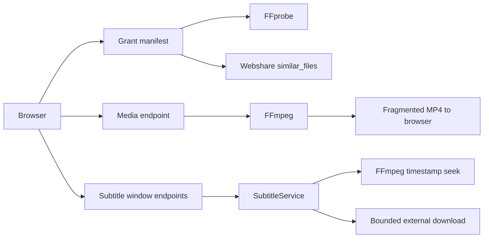

# Player implementation

## Architecture and grant security

The player uses one selected media file per playback grant. `WebshareMediaProvider`
rechecks the file, obtains a private Webshare link, and issues a one-minute grant.
Starting playback extends that grant for a film-length session. The browser uses
same-origin grant endpoints; the signed media URL stays in server memory and the
Webshare credential stays in the server-side secret store. The server refreshes the private URL after its short local
cache expires. Grant revocation stops the active media process and cancels
subtitle work.

## Probe, Range, and media stream

`createVideoLink` checks the remote source with `Range: bytes=0-0`. It requires
HTTP 206 and a valid `Content-Range: bytes 0-0/<size>`; an ignored or malformed
range fails preparation. `ffprobe` reads the remote URL and finds duration,
video, audio, and supported text subtitle streams. The manifest includes
seekability, source size when Webshare reports it, the Webshare file ID as source
identity, stream metadata, and discovered external subtitles. Bitmap subtitles
such as PGS and VobSub are excluded from usable text tracks.

`GET /api/v1/playback/grants/:id/media?start=<seconds>&audio=<index>` starts an
FFmpeg process. Input-side `-ss` lets FFmpeg seek into the remote file. The first
video stream is copied from the beginning when it is H.264 with a compatible
4:2:0 pixel format. After a seek, FFmpeg encodes H.264/yuv420p even for those
sources: stream copy would retain video from the preceding keyframe while AAC
audio starts at the requested timestamp, putting audio ahead of the picture.
Other video codecs are always encoded to H.264/yuv420p. Selected audio is encoded to AAC and
tracks with more than two channels are downmixed to stereo. Output remains
fragmented MP4 (`frag_keyframe`, `empty_moov`, `default_base_moof`, one-second
fragment target). The generated stream has no browser-facing byte-range seek.
Seeking or changing audio stops the previous stream and starts a new one at the
absolute title position. Subtitle selection and cached windows survive an audio
restart. A stream with no output for three minutes is terminated and logged as
timed out; active movie-length streams continue as long as output progresses.
After a playback failure, the player can request a new stream from its last
known position with `refresh=1`, which bypasses the short private-link cache.

## Embedded subtitle windows

`GET /api/v1/playback/grants/:id/subtitles/:streamIndex/window?startMs=<ms>&durationMs=120000`
returns `{trackId,startMs,endMs,cues}` in JSON. All timestamps are absolute
movie milliseconds. The server aligns requests to deterministic windows, clips
the final window to movie duration, and rejects negative timestamps or windows
outside 30–300 seconds. The normal duration is 120 seconds. Cues overlapping a
window are included, including those starting shortly before it.

`SubtitleService` asks FFmpeg for only the selected text stream. It seeks ten
seconds before the aligned window with input-side `-ss`, preserves absolute
timestamps with `-copyts`, and stops at the absolute end with output-side `-to`.
The command emits WebVTT to a bounded pipe; the service parses and deduplicates
cues, filters by interval overlap, and returns JSON. Using output-side `-t`
with `-copyts` was tested and discarded because it can cut off late cues.
For Matroska SubRip, an all-stream `ffprobe` packet scan covers the requested
time interval before extraction. An empty window returns immediately after that
scan; a populated window passes the target packet count to FFmpeg `-frames:s`.
Keeping all streams in the preflight lets video/audio packet timestamps end the
interval even when subtitle packets are sparse. FFmpeg 9 may still read far
beyond a sparse populated window; the extraction timeout remains a hard bound.
Extraction has a 45-second timeout, a 2 MiB output cap, and at most two active
subtitle jobs. The ten-second lookback covers ordinary boundary-spanning cues;
an unusually long cue beginning earlier may still be missed after a seek.

The browser keeps nearby windows, requests the current window immediately, and
prefetches the next after 80% of the current window. A seek aborts old requests
and increments a generation token so stale responses cannot replace new state.
Video seek and subtitle fetching proceed concurrently. The player deduplicates
the same cue across adjacent windows and renders against the absolute media
clock. Local SRT, VTT, ASS, and SSA upload remains available; native `<track>`
placement is not used. Cue text is updated from media `timeupdate` events.

## External subtitles

For Webshare grants, discovery uses one `similar_files` metadata request and its
subtitle group. The provider offers filename-related suggestions, not a
guaranteed listing of the media file's directory. Candidates must have
SRT/VTT/ASS/SSA extensions, be at most 5 MiB, and match the selected release
conservatively. The matcher recognizes language and forced/default suffixes,
removes common release tokens, and requires the same episode number for TV or
year for movie normalization. Potentially unrelated files are omitted. The
manifest exposes candidate ID, filename, format, language, status, and match
score. No direct subtitle URL is sent to the browser.

`GET /api/v1/playback/grants/:id/subtitles/external/:fileId/window?startMs=<ms>`
requires the file ID to be in that grant's discovered candidates. On first use,
the server rechecks the file restrictions, downloads it once through an
allowlisted HTTPS Webshare host with a hard 5 MiB limit, verifies that its name
has not changed, and parses all cues. Later windows filter the cached cues.
UTF-8, UTF-16 BOM, and Windows-1250 text are supported. ASS/SSA override tags
are stripped while text and line breaks are kept; complex fonts, animation,
placement, and karaoke styling are not rendered.

## Cache, cancellation, and failures

The dedicated subtitle cache is in memory and bounded to 32 MiB with eviction.
Embedded keys contain converter version, provider/media ID, size when known,
grant identity, track, and canonical window. Grant identity prevents stale data
being reused when Webshare cannot supply an immutable content version. External
files are parsed and cached by grant and file ID; adjacent windows reuse the
same downloaded cues. Concurrent requests for the same key share one job.
Each request can detach on browser abort; the FFmpeg/download job is canceled
when no subscribers remain. A closed server cancels all subtitle jobs.

Non-seekable sources fail playback preparation's Range check. If a ticket
explicitly reports no Range support, embedded subtitle windows return
`SUBTITLE_SOURCE_NOT_SEEKABLE`; the server does not launch a whole-file scan.
Invalid windows, busy processing, and extraction failures return fixed codes.
Structured logs record phases, counts, duration, and fixed error codes without
source URLs, grant IDs, credentials, or FFmpeg stderr. The old full-track
`202`/`Retry-After` subtitle endpoint has been removed with the client migration.

## Audio output and series playback

The Audio menu shows source channel layout. The player applies the saved output
device through `HTMLMediaElement.setSinkId` where supported, otherwise uses the
system default and shows a notice. Settings can refresh available devices and
play a short test cue. If autoplay is refused, a manual Play action is shown.
At the end of a series episode, the player can fetch an updated episode guide
and show a cancellable five-second next-episode countdown.

## Validation and limitations

The server Docker image installs Debian Bookworm's FFmpeg 5.1 family; the exact
Debian package revision is currently not pinned. At startup the server logs the
first `ffmpeg -version` and `ffprobe -version` lines as
`MEDIA_TOOLCHAIN_VERSION`. The timestamp and HTTP Range fixture was run against
FFmpeg 5.1.2 and 9.0.2 on a local 600-second, approximately 17 MiB MKV/MP4
pair. The integration test compares a late subtitle window with the former
full-track extraction: the window issued nonzero byte-range requests and read
less than half as many remote bytes. MKV and MP4 both retained absolute cues.
MP4 used `mov_text`; MKV tested SubRip and ASS. For a populated sparse MKV
SubRip interval spanning two cues, FFmpeg 5.1.2 read substantially less than
FFmpeg 9.0.2; a 120-second window with one cue read about 70% of this small
fixture under 9.0.2. This is a container/version limitation, not constant-cost
random access.
The deployed build needs HTTP/HTTPS input, Matroska and MOV/MP4 demuxers,
SubRip/ASS/`mov_text` subtitle decoders, WebVTT output, H.264/libx264, and AAC.
The automated fixture skips when FFmpeg/ffprobe are absent. Local loopback
timings are not a Webshare latency benchmark. Live Webshare byte-range behavior
still depends on each returned CDN link; the preparation probe is the runtime
capability check.

The design does not provide adaptive bitrate, seamless audio rendition changes,
bitmap subtitle OCR, or full ASS styling. HLS/DASH remains a possible future
transport if adaptive bitrate or CDN distribution becomes necessary. The
in-memory subtitle cache can later gain a persistent media version key if the
provider exposes a trustworthy immutable hash or revision. Very sparse
Matroska text codecs other than validated SubRip may still make FFmpeg scan
past the requested time window; extraction caps and timeout apply, and a
codec-specific bounded path is a follow-up.
